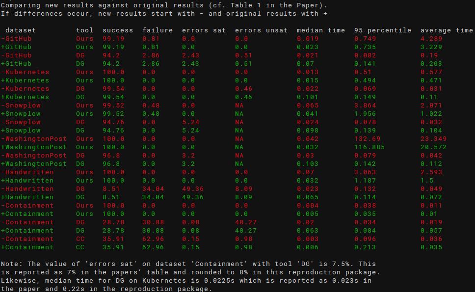
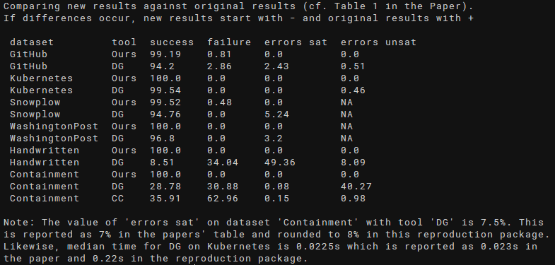

# JSON Schema Witness Generation - Reproduction Package

This is a reproduction package for the article Witness Generation for JSON Schema
by Lyes Attouche, Mohamed-Amine Baazizi, Dario Colazzo, Giorgio Ghelli, Carlo Sartiani, and Stefanie Scherzinger.

This reproduction package was created by Stefan Klessinger.
It is provided as a Docker container.

Our original results, consisting of the table reporting our summary results as a csv and charts, are available in directory [results](artifacts/results). 

## Basic Reproduction
### System Requirements
Docker and a Linux Kernel version compatible with Ubuntu 20.04 are required.

We successfully tested our reproduction package on both x86-64 and ARM64 (Apple M1) CPUs. 
Our experiments are configured to consume up to 10 GiB of RAM, in addition to RAM required by Docker and the host OS. Our testing systems had a minimum of 16 GB RAM. 
### Setting up the Docker Container
First, clone this repository with 
``git clone https://github.com/sdbs-uni-p/JSONSchemaWitnessGeneration.git``. 

To build the container, run ``docker build -t wg_repro .`` inside the root directory of this repository.

After building, start the container with ``docker run -it wg_repro``. You may include the flag ``--name <name>`` (replacing ``<name>`` with a name of your choice) to identify the container more conveniently.

The contents of [artifacts](artifacts) are copied into the container's home directory (``/home/repro/``). Paths described in this README are always relative to ``/home/repro/`` (or ``artifacts``, respectively) unless explicitly stated otherwise.

### Reproduction in 3 Steps
The basic reproduction workflow inside the container is as follows:
* Run ``./doAll.sh``, executing all experiments, including chart generation and evaluation. On our test system with an Intel Xeon Silver 2.40GhZ CPU this took approximately 10 hours.
  * All results will be stored in ``results``, overwriting the original charts in ``results/charts``. Results for each dataset, including logs of errors and warnings, are stored in correspondingly named subdirectories, divided into satisfiable (-sat) and unsatisfiable (-unsat) schemas, if necessary. Additionally, results are summed up in ``results.csv`` and ``evaluation.txt``, the latter containing some additional comments. 
* Run ``scripts/compare.sh``, producing a diff-like comparison of the new results against our original results
  * By default, this script does not compare the system-specific runtimes. Use the optional parameter -t to enable comparison of runtime.
* Confirm successful reproduction:
    * Inspect the output of ``scripts/compare.sh -t`` which produce an output showing different runtimes, like in the following screenshot (original results are shown in green, new results in red; use -c to disable colors):
      
    * Inspect the output of ``scripts/compare.sh`` which should show no differences and look similar to the following screenshot:
      
    * Inspect ``results/evaluation.txt`` for additional insights into the evaluation, such as manual corrections we had to make, as also described in the paper.
    * To inspect the generated charts, they need to be copied to the host system - see section [Moving Output to the Host System](#moving-output-to-the-host-system)

## Advanced Topics
### Artifact Availability
In this reproduction package, our own tool, as well as competitor tools are executed on the same datasets as in the accompanying paper. The datasets are stored in [JSONAlgebra/JsonSchema_To_Algebra/expDataset](artifacts/JSONAlgebra/JsonSchema_To_Algebra/expDataset). Datasets containing both, satisfiable and unsatisfiable, schemas are divided accordingly into subdirectories ``sat``  and ``unsat``. In the GitHub dataset, we have different satisfiable datasets for jsongenerator (sat-dg) and our tool (sat), where different files are excluded as the tools had problems (e.g., exceeding the timeout) processing them. These files are considered as failures in our evaluation script. Likewise, the Snowplow dataset is divided into different datasets for jsongenerator (dg) and our tool (ours), the latter missing two schemas that exceeded the timeout during our experiments which are also counted as failures in our evaluation script.

We also provide the excluded GitHub and Snowplow schemas in the following directories (relative to [JSONAlgebra/JsonSchema_To_Algebra/expDataset](artifacts/JSONAlgebra/JsonSchema_To_Algebra/expDataset)):
* [github/excluded-ours](artifacts/JSONAlgebra/JsonSchema_To_Algebra/expDataset/github/excluded-ours) contains 52 schemas that caused problems with our tool, grouped into subfolders by type of error.
* [github/excluded-dg](artifacts/JSONAlgebra/JsonSchema_To_Algebra/expDataset/github/excluded-dg) contains 10 schemas that caused problems with jsongenerator, grouped into subfolders by type of error.
* [snowplow/excluded-ours](artifacts/JSONAlgebra/JsonSchema_To_Algebra/expDataset/snowplow/excluded-ours) contains two schemas on which our tool exceeded the specified timeout of one hour in our experiments.

These schemas are not processed by default when running our experiments. See section [Executing Experiments on Specific Datasets](#executing-experiments-on-specific-datasets) on how to run experiments on these schemas.   

The source code of our tool is available in [JSONAlgebra](artifacts/JSONAlgebra).

### Running Experiments
We provide a number of scripts for running our experiments inside the container.

To run all experiments including chart generation and evaluation, run ``./doAll.sh``. Note that this will take several hours (approximately 10 hours on our testing system).

There are additional scripts located in [scripts](artifacts/scripts) for running individual experiments:
* ``run-JSONAlgebra.sh`` performs experiments on all datasets with our tool. See the following sections for optional parameters.
* ``run-jsongenerator.sh`` performs experiments on all datasets with jsongenerator (DG).
* ``evalContainment.py`` performs and evaluates experiments on the containment dataset for jsonsubschema (CC). Opposed to the other tools, these experiments are performed from scratch with each execution and the results are not persisted.

### Executing Experiments on Specific Datasets
To execute experiments on a specific dataset (e.g., the excluded datasets mentioned above), supply the optional parameter ``-i <dataset>`` to ``run-JSONAlgebra`` or ``run-jsongenerator``, replacing ``<dataset>`` with the datasets path, relative to [JSONAlgebra/JsonSchema_To_Algebra/expDataset](artifacts/JSONAlgebra/JsonSchema_To_Algebra/expDataset).

For instance, to run experiments with our tool on [github/excluded-ours/timeout](artifacts/JSONAlgebra/JsonSchema_To_Algebra/expDataset/github/excluded-ours/timeout), run ``./run-JSONAlgebra -i github/excluded-ours/timeout``. Results will be stored in a subdirectory of [results](artifacts/results), named like the dataset with slashes (/) replaced by dashes (-). Hence, in our example, results will be stored in ``results/github-excluded-ours-timeout``.

### Additional Settings
By default, ``run-JSONAlgebra.sh`` runs single-threaded without a timeout. The settings can be changed through parameters ``--timeout <ms>`` and ``--threads <number>``, allowing to specify, as integer values, the timeout in ms and the number of threads.

In ``doAll.sh``, a timeout of two hours per individual schema is set, to avoid excessively long runtimes. Our test dataset only contains schemas that were processed within an hour on our testing system. In case your system is considerably slower, please consider increasing the timeout.

### Evaluating and Comparing Results
Evaluation is performed by ``evaluate.py`` in [scripts](artifacts/scripts). This script generates a text output describing results and comments on a few selected manual fixes we had to make, e.g., due to incorrect results produced by the third-party schema validator. In addition, a csv file, ``results.csv``, mimicking Table 1 in our paper is stored in ``results``. Experiments for jsonsubschema (CC) are created dynamically when running this script, with an execution time of approximately one minute on our systems. 

When executing ``doAll.sh``, the output of ``evaluate.py`` is stored in ``results/evaluation.txt``.

To compare the computed results with the results stated in the paper, execute ``compare.sh`` in [scripts](artifactts/scripts). This compares ``results.csv``, generated by ``evaluate.py``, against [original_results.csv](artifacts/results/original_results.csv), generating a diff-like output. ``compare.sh`` does not compare runtimes by default, since they will always differ between runs and takes two optional parameters:
* ``-t`` enables comparison of runtimes
* ``-c`` disables colored (red/green) output for reasons of visual accessibility

### Generating Charts
To generate charts, execute ``create-charts.sh`` in [charts](artifacts/charts) inside the docker container. The generated charts are stored in [results/charts](artifacts/results/charts), overwriting the original charts. When executing ``doAll.sh``, charts are automatically generated and stored at the same location.

### Moving Output to the Host System

All results are stored at /home/repro/results in the container. To copy the results to the host system, use ``docker cp <containerID>:/home/repro/results .`` having obtained the containerID using ``docker ps``. If you use the ``--name`` flag, as explained above, you can replace the containerID with the chosen name.

### Known Issues
Due to partially undeterministic behavior of our implementation, a small deviation in results might occur. We only observed an issue with a single schema, o60883.json, in ``github/sat``. In a small number of cases, processing of this schema did not terminate in a reasonable time. In ``doAll.sh``, a timeout of 2 hours per schema is configured, resulting in a TimeoutException for that schema in these cases. We do not recommend executing ``run-JSONAlgebra.sh`` without configuring a timeout.

While testing our reproduction package, we sometimes had issues with the availability of external resources during the build process. We provide pre-compiled binary containers on Zenodo, in case external resources are temporarily or permanently unavailable.
