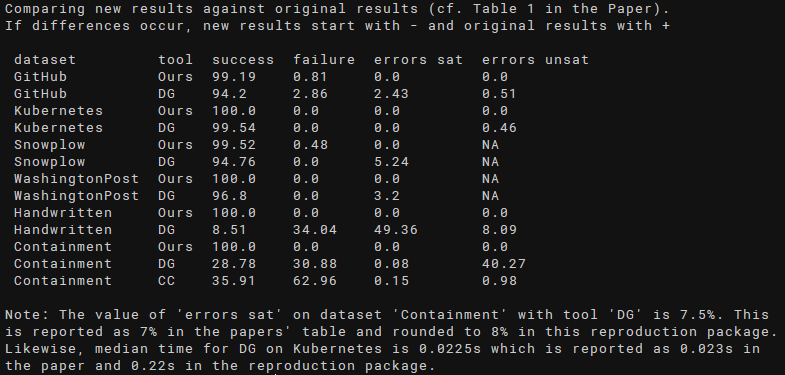
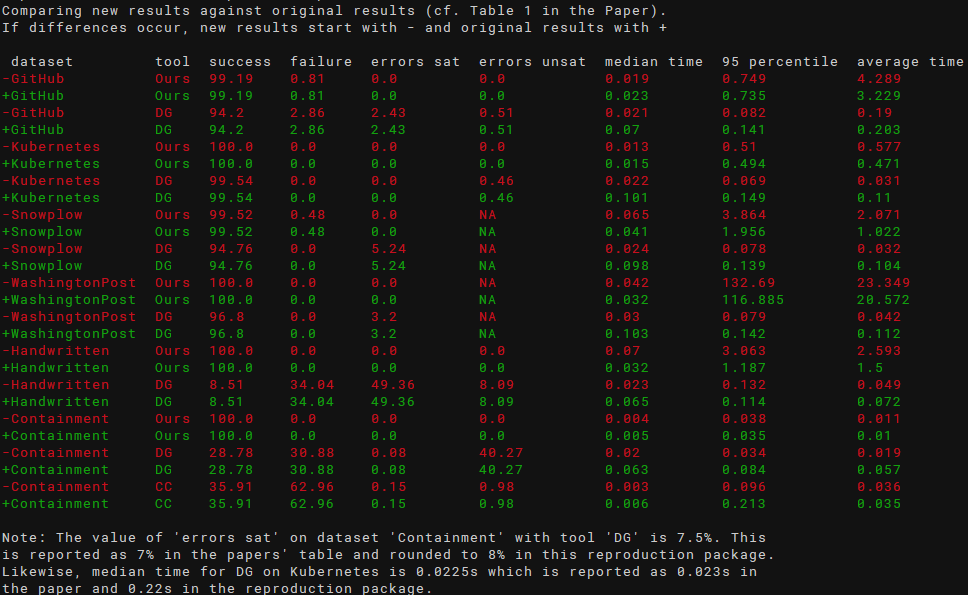

# JSON Schema Witness Generation - Reproduction Package

This is a reproduction package for the article [Witness Generation for JSON Schema](http://arxiv.org/abs/2202.12849),
by Lyes Attouche, Mohamed-Amine Baazizi, Dario Colazzo, Giorgio Ghelli, Carlo Sartiani, and Stefanie Scherzinger.

This reproduction package has been created by Stefan Klessinger.
It is provided as a Docker container.

Our original results, consisting of charts and a csv file, are available in directory [results](artifacts/results). Charts are overwritten if you execute the experiments.

## Basic Reproduction
### System Requirements
We successfully tested our reproduction package on both x86-64 and ARM64 (Apple M1) CPUs. 
Our experiments are configured to use up to 10 GiB of RAM, in addition to RAM required by Docker and the host OS. Our testing systems had a minimum of 16 GB RAM. 
### Setting up the Docker Container
First, clone this repository with 
``git clone https://github.com/sdbs-uni-p/JSONSchemaWitnessGeneration.git``. 

To build the container, run ``docker build -t wg_repro .`` inside the root directory of this repository.

After building, you can start the container with ``docker run -it wg_repro``. You can include the flag ``--name <name>`` (replacing ``<name>`` with a name of your choice) to identify the container more easily.

The contents of [artifacts](artifacts) are copied into the container's home directory (``/home/repro/``). Paths described in this Readme are always relative to ``/home/repro/`` (or ``artifacts``, respectively) unless explicitly stated otherwise.

### Reproduction in three Steps
The basic reproduction workflow inside the container is as follows:
* Run ``./doAll.sh``, executing all experiments, including chart generation and evaluation. On our test system with an Intel Xeon Silver 2.40GhZ CPU this took around 10 hours.
* Run ``scripts/compare.sh``, producing a diff-like comparison of the new results against our original results
  * This script ignores runtimes by default. Use the optional parameter -t to enable comparison of runtime.
* Confirm successful reproduction:
    * Inspect the output of ``scripts/compare.sh`` which should show no differences and look similar to this:
      
    * Inspect the output of ``scripts/compare.sh -t`` which produce an output showing different runtimes, similar to this (original results are green, new results are red; use -c to disable colors):
      
    * Inspect ``results/evaluation.txt`` for additional insights into the evaluation, such as manual corrections we had to make.
    * To inspect the generated charts, they need to be copied to the host system - see section [Moving Output to the Host System](#moving-output-to-the-host-system)

## Advanced Topics
### Datasets
In this reproduction package, our own tool, as well as competitor tools are executed on the same datasets as in the accompanying paper. The datasets are stored in [JSONAlgebra/JsonSchema_To_Algebra/expDataset](artifacts/JSONAlgebra/JsonSchema_To_Algebra/expDataset). Datasets containing both, satisfiable and unsatisfibale, schemas are divided accordingly into subdirectories ``sat``  and ``unsat``. In the GitHub dataset, we have different satisfiable datasets for jsongenerator (sat-dg) and our tool (sat), where different files are excluded as the tools had problems (e.g., exceeding the timeout) with processing them. These files are considered as failures in our evaluation script. Likewise, the Snowplow dataset, is divided into different datasets for jsongenerator (dg) and our tool (ours), the latter missing two schemas that exceeded the timeout during our experiments which are also counted as failures in our evaluation script.

We also provide the schemas in the GitHub and Snowplow dataset that were excluded in the following directories (relative to [JSONAlgebra/JsonSchema_To_Algebra/expDataset](artifacts/JSONAlgebra/JsonSchema_To_Algebra/expDataset)):
* [github/excluded-ours](artifacts/JSONAlgebra/JsonSchema_To_Algebra/expDataset/github/excluded-ours) contains 52 schemas that caused problems with our tool, grouped into subfolders by type of error.
* [github/excluded-dg](artifacts/JSONAlgebra/JsonSchema_To_Algebra/expDataset/github/excluded-dg) contains 10 schemas that caused problems with jsongenerator, grouped into subfolders by type of error.
* [snowplow/excluded-ours](artifacts/JSONAlgebra/JsonSchema_To_Algebra/expDataset/snowplow/excluded-ours) contains two schemas on which our tool surpassed the specified timeout in our experiments.

These schemas are not processed by default when running our experiments. See section [Executing Experiments on Specific Datasets](#executing-experiments-on-specific-datasets) to run experiments on these schemas.   

### Running Experiments
We provide a number of scripts for running our experiments inside the container.

To run all experiments including the the generation of charts and the evaluation, execute ``./doAll.sh``. Note that this will take **several hours** (around 10 hours on our testing system).

There are additional scripts located in [scripts](artifacts/scripts) for running individual experiments:
* ``run-JSONAlgebra.sh`` performs experiments on all datasets with our tool. Note that the originals results we provide, as well as the results used for generating charts are overwritten by the new results generated by this script.
* ``run-jsongenerator.sh`` performs experiments on all datasets with jsongenerator (DG). Note that the originals results we provide are overwritten by this script.
* ``evalContainment.py`` performs and evaluates experiments on the containment dataset for jsonsubschema (CC). Opposed to the other tools, these experiments are performed from scratch with each execution and not stored in results.

### Executing Experiments on Specific Datasets
To execute experiments on a specific dataset (e.g., the excluded datasets mentioned above), supply the optional parameter ``-i <dataset>`` to ``run-JSONAlgebra`` or ``run-jsongenerator``, replacing ``<dataset>`` with the datasets path, relative to [JSONAlgebra/JsonSchema_To_Algebra/expDataset](artifacts/JSONAlgebra/JsonSchema_To_Algebra/expDataset).

For instance, to run experiments with our tool on [github/excluded-ours/timeout](artifacts/JSONAlgebra/JsonSchema_To_Algebra/expDataset/github/excluded-ours/timeout), run ``./run-JSONAlgebra -i github/excluded-ours/timeout``. Results will be store in a subdirectory of [results](artifacts/results), named like the dataset with slashes (/) replaced by dashes (-). Hence, in our example, results will be stored in ``results/github-excluded-ours-timeout``.

### Evaluating and Comparing Results
Evaluation is performed by ``evaluate.py`` in [scripts](artifacts/scripts). When executing ``./doAll.sh``, charts are automatically generated and stored at the same location.This script generates a text output describing results and comments on a few selected manual fixes we had to make, e.g., due to incorrect results produced by the third-party schema validator. In addition, a csv file, results.csv, mimicking Table 1 in our paper is stored in [results](artifacts/results). Experiments for jsonsubschema (CC) are created dynamically when running this script, leading to an execution time of around a minute on our systems. 

When executing ``./doAll.sh``, the output of ``evaluate.py`` is stored in ``results/evaluation.txt``.

To compare the computed results with the results stated in the paper, execute ``compare.sh`` in [scripts](artifactts/scripts). This compares ``results.csv`` generated by ``evaluate.py`` against [original_results.csv](artifacts/results/original_results.csv), generating a diff-like output. ``compare.sh`` ignores runtimes by default and takes two optional parameters:
* ``-t`` enables comparison of runtimes
* ``-c`` disables colored (red/green) output

### Generating Charts
To generate charts, execute ``./create-charts.sh`` in [charts](artifacts/charts) inside the docker container. The generated charts are stored in [results/charts](artifacts/results/charts). When executing ``./doAll.sh``, charts are automatically generated and stored at the same location.

### Moving Output to the Host System

All results are stored at /home/repro/results in the container. To copy the results to the host system, use ``docker cp <containerID>:/home/repro/results .`` after obtaining the containerID using ``docker ps``. If you use the ``--name`` flag, as explained above, you can replaced the containerID with the chosen name.
